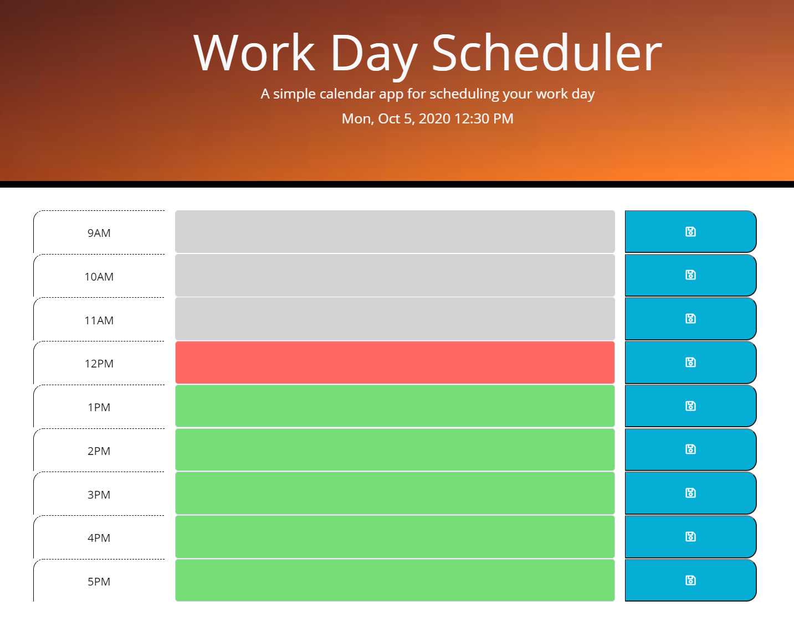

# Work-Day-Scheduler
  * A simple daily planner application that allows the user to save relevant events for each standard business hour of the day to manage time effectively.

Explore the [project-page](https://github.com/Mgithub89/Work-Day-Scheduler.git)

View the [deployed-app](https://mgithub89.github.io/Work-Day-Scheduler/)

### Table of contents
   * [About The project](#About-The-Project)
   * [Mock-Up](#Mock-Up)
   * [Built With](#Built-With)
   * [Contact](#Contact)

 ## About The Project 
  
  The objective of this project is to create a simple daily planner application that allows a user to save events for each standard business hour of the day based on a user acceptance criteria.
  This app displays current day at the top of the callendar by using **Moment.js** and allows a user to create a schedule for each colored time block that indicates whether it is in the past(grey colored), present(red colored) or future(green colored) based on time of the day. The user can also save each time block input text  in local storage by clicking the save button.

## Mock-Up

## Built With 
   *  HTML
   *  Bootstrap - CSS Framework
   *  Jquery - JavaScript Library
   *  Moment.js - JavaScript Library
    

## Contact
Metages Worku - [metages09@gmail.com](mailto:metages09@gmail.com)
