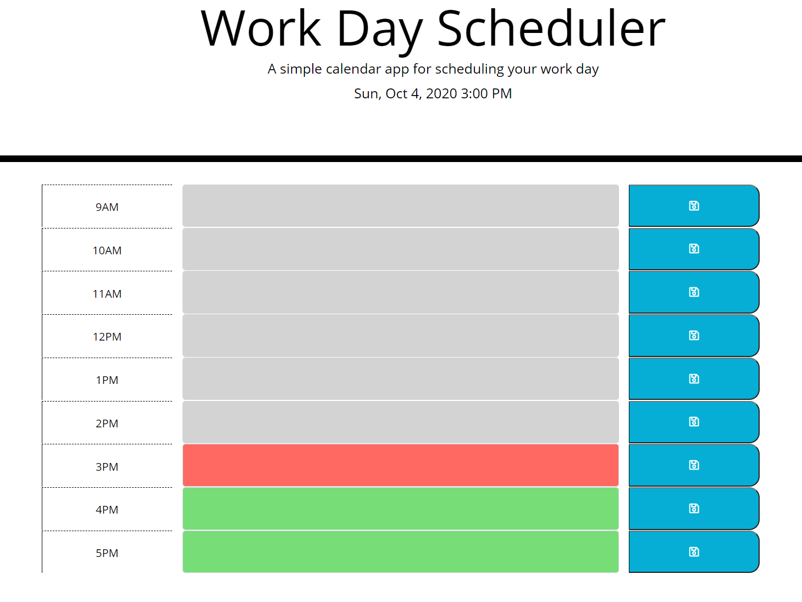

# Work-Day-Scheduler
  * A simple calendar application that allows the user to save events for each standard business hour of the day.

Explore the [project-page](https://github.com/Mgithub89/Work-Day-Scheduler.git)

View the [deployed-app](https://mgithub89.github.io/Work-Day-Scheduler/)

### Table of contents
   * [About The project](#About-The-Project)
   * [Mock-Up](#Mock-Up)
   * [Built With](#Built-With)
   * [Contact](#Contact)

 ## About The Project 
  
  The objective of this project is create a simple calendar application that allows a user to save events for each standard working hour of the day based on a user acceptance criteria.
  This app displays current day at the top of the callendar by using **Moment.js** and allows a user to create a schedule for each colored time block that indicates whether it is in the past(grey colored), present(red colored) or future(green colored). The user can also enter an event and save in local storage .

## Mock-Up

## Built With 
   * HTML
   * CSS
   * JavaScript/JQuery
   * Moment.js
   * Bootstrap

## Contact
Metages Worku - [metages09@gmail.com](mailto:metages09@gmail.com)
